# ToDoList

###     1. 초기화면

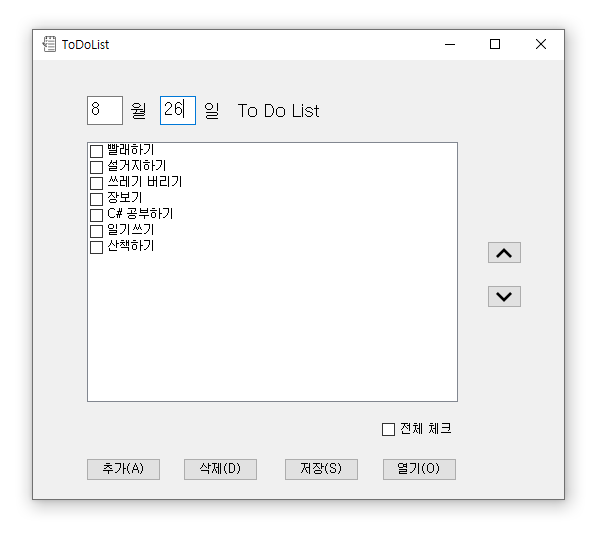

###     2. 추가하기

​    추가하기 버튼 클릭 혹은 단축키 A 누를시.

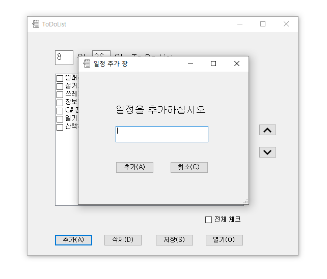

​    일정 추가 이후.

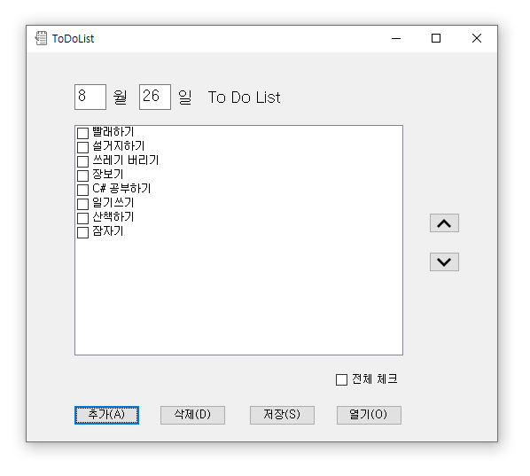

###     3. 삭제하기

​    삭제하기 이전 삭제할 item check.

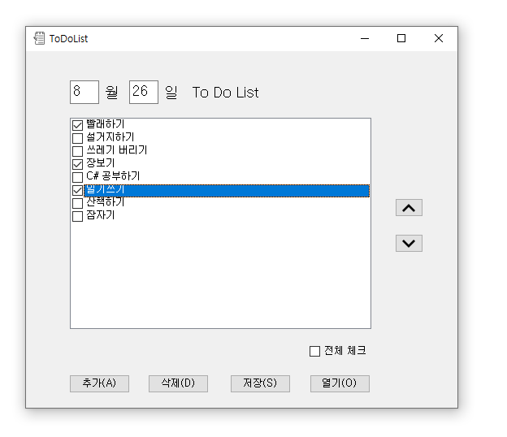

​    삭제하기 버튼 클릭시 혹은 단축키 D 누를시 삭제된 모습 확인 가능.

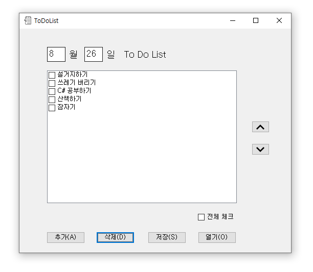

###     4. 저장하기

​    저장할 item만 check.

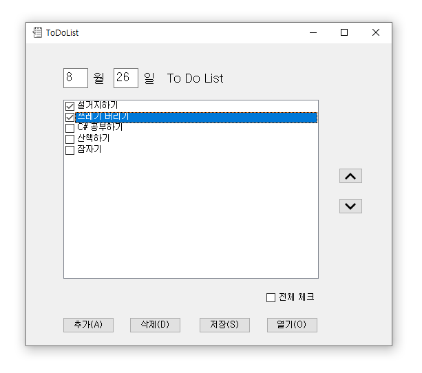

​    저장 버튼 혹은 단축키 S 누를시에 초기 directory가 지정된 dialog가 뜨고 저장 가능.

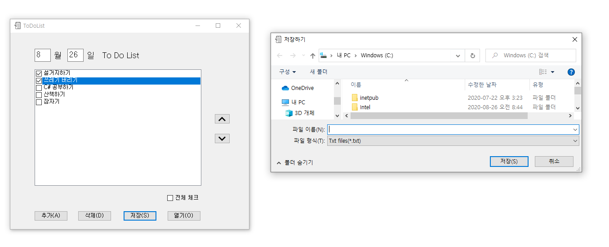

​    textfile로 저장된 모습 확인 가능.

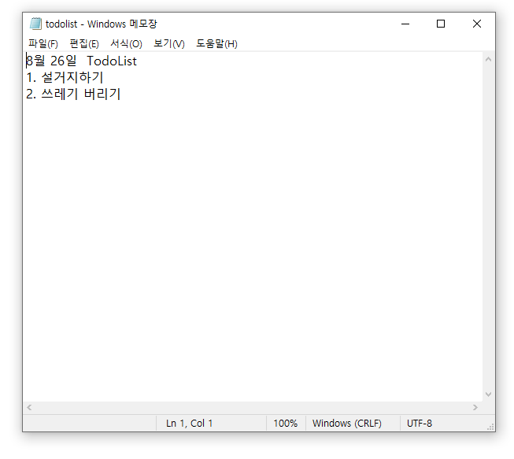

###     5. 열기

​    열기버튼 클릭 또는 단축키 O 누를시에 초기 directory가 지정된 dialog가 뜨고 열기 가능.

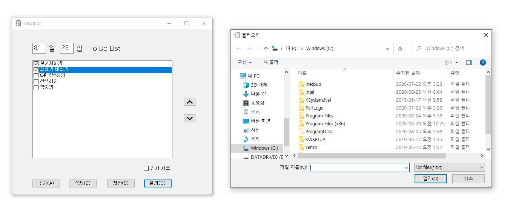

​    textfile대로 열린 모습 확인 가능.

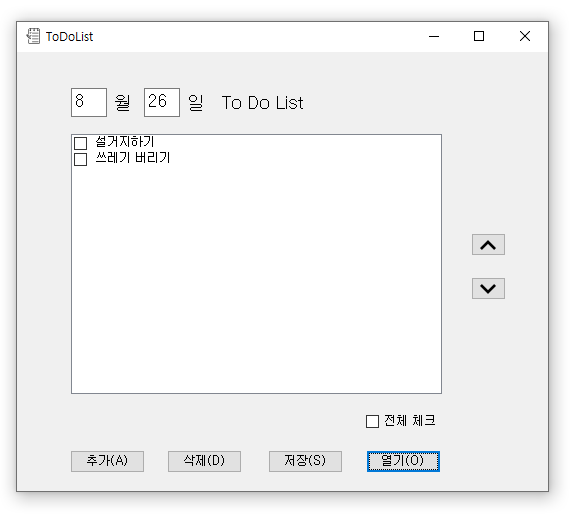

###     6. 부가기능

​         전체 체크 누를 시에 모든 item check 된 것 확인 가능.

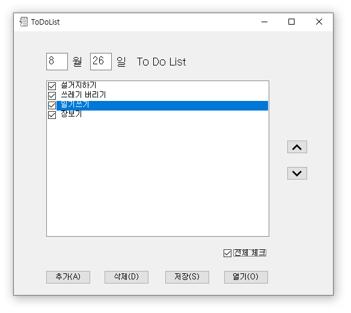

​         옆의 화살표로 우선순위 대로 순서 변경 가능.

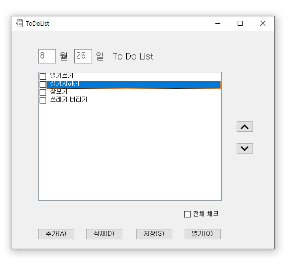

